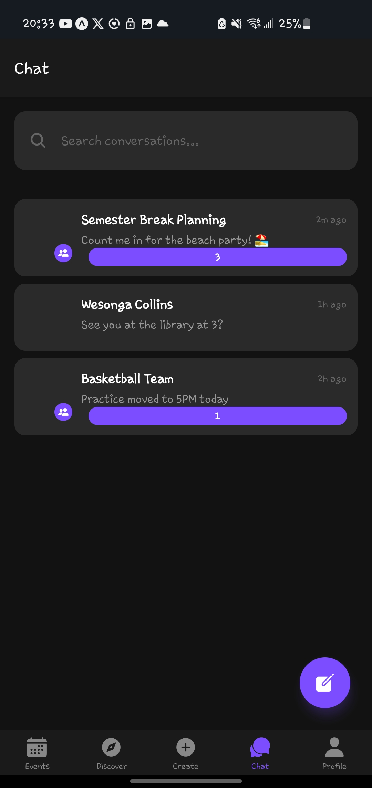

# Allied - Campus Social Media App


## 📖 About Allied

**Allied** is a campus social media app built with **TypeScript** and **Node.js** that connects students effortlessly. It is designed for students who may find it challenging to socialize in traditional settings, offering a convenient platform to connect with campus events and activities.

With Allied, students can explore both **indoor** and **outdoor** events within their campus or participate in **campus-organized external events.**

---

## ✨ Features

- 🗓 **Event Discovery:** Explore and RSVP to events happening on campus.
- 🤝 **Social Connections:** Connect with like-minded peers through shared interests.
- 🔔 **Event Notifications:** Get reminders for upcoming events.
- 🏫 **Campus Exclusive:** Join events hosted by campus clubs and organizations.
- 🌐 **Off-Campus Participation:** Stay informed about off-campus events hosted by your campus community.

---

## 🚀 Screenshots

Take a look at some screenshots showcasing Allied:

| Profile Screen | Event Details | Create Screen | Discover Details | Chat Screen |
|--------------|---------------|--------------|--------------|---------------|--------------|

|  |  |  | |  |

---

## 🛠 Tech Stack

- **Frontend:** TypeScript
- **Backend:** Node.js

---

## ⚡ Installation

Follow these steps to install and run Allied locally:

1. **Clone the Repository:**
    ```bash
    git clone https://github.com/Isaiahmukiibi/Allied.git
    cd Allied
    ```
2. **Install Dependencies:**
    ```bash
    npm install
    ```

3. **Start the App:**
    ```bash
    npx expo start
    ```

---

## 📬 Contributing

We welcome contributions! To contribute:

1. Fork the repository
2. Create a new branch (`git checkout -b feature/new-feature`)
3. Commit your changes (`git commit -m 'Add some feature'`)
4. Push to the branch (`git push origin feature/new-feature`)
5. Open a Pull Request

---

## 🛡 License

This project is licensed under the **MIT License**. See the [LICENSE](LICENSE) file for details.

---

## 📧 Contact

For any questions or inquiries, reach out via GitHub: [Isaiahmukiibi](https://github.com/Isaiahmukiibi)

